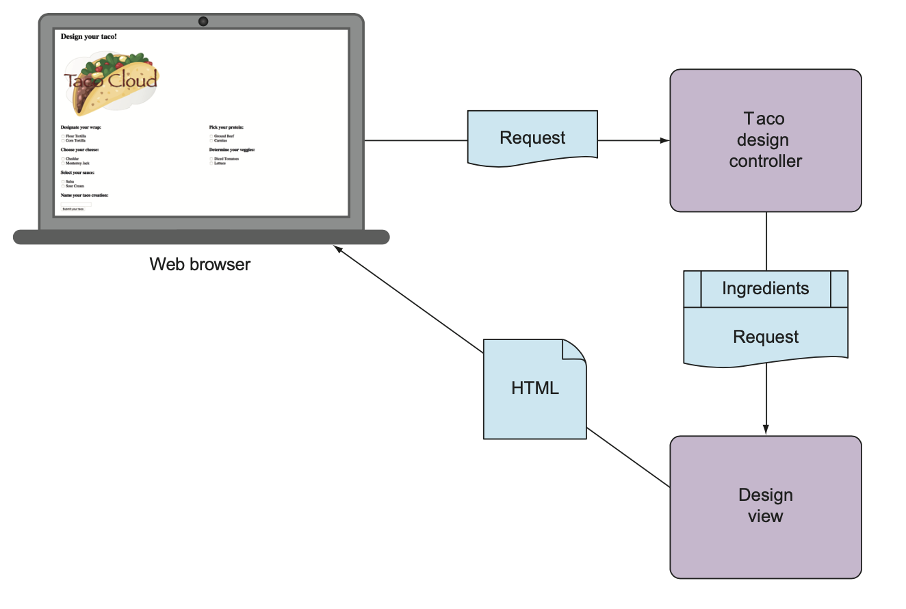
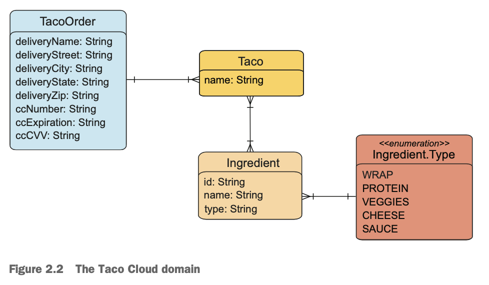
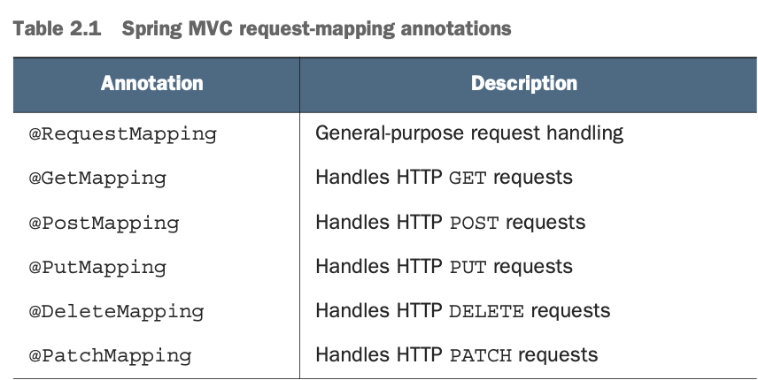

# Displaying information
We will develop a page with selection of ingridients. Ingridients should not be hardcoded to the HTML, they may change. It should be fetched from database.
**In Spring MVC:** 
- **Controller** fetches and processes data. 
- **View** renders that data into HTML that will be diplayed in the browser.
We need to create following components:
- Domain class - defines properties of taco ingredient
- Spring MVC Controller that fetches ingredient info and passes it along the view
- View template - renders a list of ingridients in the user's browser. 
Now, controller will simply provide ingridients to the view.
## Establishing domain
Domain - subject area that it addresses—the ideas and concepts that influence the understanding of the application.
Our domain will look like below:

Firstly, we will define ingridients:
```java
import lombok.Data;  
  
@Data  
public class Ingredient {  
  
    private final String id;  
	private final String name;  
	private final Type type;  
  
	public enum Type {  
        WRAP, PROTEIN, VEGGIES, CHEESE, SAUCE  
	}  
}
```
`@Data` - annotation from Lombok library, it generates `hashCode()` and `equals()` methods, and also constructors to set `final` fields, and other. It helps to make a [JavaBean](https://en.wikipedia.org/wiki/JavaBeans).
Now, the Taco itself:
```java
import lombok.Data;  
import java.util.List;  
  
@Data  
public class Taco {  
    private String name;  
	private List<Ingredient> ingredients;  
}
```
Taco orders domain class: 
```java
@Data  
public class TacoOrder {  
      
     private String deliveryName;  
	 private String deliveryStreet;  
	 private String deliveryCity;  
	 private String deliveryState;  
	 private String deliveryZip;  
	 private String ccNumber;  
	 private String ccExpiration;  
	 private String ccCVV;  
	 private List<Taco> tacos = new ArrayList<>(); 
	  
	 public void addTaco(Taco taco) {  
	        this.tacos.add(taco);  
	 }   
}
```
## Controller class
Controllers do handle HTTP requests and either:
- hand off a request to a view to render HTML (browser-displayed)
- write data to the body of response (RESTful)
Now we'll focus on the first.
We'll create a controller that will just simply:
- handle HTTP `GET` request where the request path is `/design`
- build a list of ingredients
- hand off the request and the ingredient data to a view template to be rendered as HTM and sent to the requesting web browser.
Controller class:
```java
@Slf4j  
@Controller  
@RequestMapping("/design")  
@SessionAttributes("tacoOrder")  
public class DesignTacoController {  
  
	@ModelAttribute  
	public void addIngredientsToModel(Model model) {  
	    List<Ingredient> ingredients = Arrays.asList(  
	 		 new Ingredient("FLTO", "Flour Tortilla", Type.WRAP),  
			 new Ingredient("COTO", "Corn Tortilla", Type.WRAP),  
			 new Ingredient("GRBF", "Ground Beef", Type.PROTEIN),  
			 new Ingredient("CARN", "Carnitas", Type.PROTEIN),  
			 new Ingredient("TMTO", "Diced Tomatoes", Type.VEGGIES),  
			 new Ingredient("LETC", "Lettuce", Type.VEGGIES),  
			 new Ingredient("CHED", "Cheddar", Type.CHEESE),  
			 new Ingredient("JACK", "Monterrey Jack", Type.CHEESE),  
			 new Ingredient("SLSA", "Salsa", Type.SAUCE),  
			 new Ingredient("SRCR", "Sour Cream", Type.SAUCE)  
	    );  
	 
		Type[] types = Ingredient.Type.values();  
		for (Type type : types) {  
				   model.addAttribute(  
						type.toString().toLowerCase(),  
						filterByType(ingredients, type)  
				   );  
		}  
	}  
  
    @ModelAttribute(name="tacoOrder")  
    public TacoOrder order() {  
        return new TacoOrder();  
	}  
  
    @ModelAttribute(name="taco")  
    public Taco taco() {  
        return new Taco();  
	}  
  
    @GetMapping  
	public String showDesignForm() {  
	       return "design";  
	}  
  
    private Iterable<Ingredient> filterByType(  
            List<Ingredient> ingredients, Type type) {  
        return ingredients  
                .stream()  
                .filter(x -> x.getType().equals(type))  
                .collect(Collectors.toList());  
	}  
}
```
- `@Slf4j` annotation - from Lombok, in compilation time genetates SLFJ `Logger` static proprty in class. Same effect as  
```java
private static final org.slf4j.Logger log = org.slf4j.LoggerFactory.getLogger(DesignTacoController.class);
```
- `@Controller` - identify this class as a controller and mark it as a candidate for component scanning. Spring will discover it automatically, create an instance of `DesignTacoController` as a bean in Spring application context.
- `@RequestMapping(...)` at class level. Specifies kind  of requests that this controller handles. In this case, `DesignTacoController`  will handle requests whose path begins with /design.
- `@SessionAttributes("tacoOrder")`. TacoOrder object (put in model later in the class) should be maintained in session. Creation of taco is only the first step in creating an order. There are more. Order we create will need to be carried in the session so that it can span multiple requests.
### Handling a GET request
Class-level `@RequestMapping` is refined with by `@GetMapping` on method `showDesignForm()` . @GetMapping paired with `@RequestMapping` specifies that `showDesignForm()` method is handler for HTTP GET request with /design path.

- Method `showDesignView()` just returns String "design". This is the logical name of the view that will be used to render the model to browser. 
But before it does that, method fullfiles given `Model` with an empty `Taco` object associated with key "design". It will create a blank state on the form.
- Method `addIngredientsToModel()` is annotated with `@ModelAttribute`. It is invoked when request is handled and puts a a list of `Ingredient` into the model. List if hardcoded now, soon it will be fetched from the database.
- `Model`  is an object that transfers data between controller and any view. Data, that's placed in `Model` attributes is copied into the **servlet** **request** **attributes**. View can find them and use to render a page in the user's browser.
- `addIngrediendsToModel()` adds ingredient types as an attribute to the Model object that will be passed into `showDesignForm()`. 
- There are two methods with `@ModelAttributes` annotation. They create and return new `TacoOrder` and `Taco` objects and place into the model. 
- `TacoOrder` object is referred earlier in `@SessionAttributes`, holds state for being built as user create tacos accross multiple requests.
- `Taco` object is placed into the model so that the view rendered in response ot GET request for /design will have non-null object to display.
*Now it works in following way.* If we point /design path, methods `showDesignForm()` and `addIngrediendsToModel()` start to work, placing empty `Taco` and ingredients into the model before passing the request in to the view.
## Designing the view
- **Thymeleaf** is designed to be decoupled from any particular web framework. It cannot work with Spring abstractions, such as `Model` , but it works with servlet request attributes.
So, before Spring hands the request over to view, it copies model data into request attributes, and then Thymeleaf have access to that data.
- Thymeleaf uses HTML with some additional attributes.
Example: 
```html
 <p th:text="${message}">placeholder message</p>
```
- While rendering body of `<p>` will be replaced with the value of servlet request attribute with key "message". `th:text` attribute - from **Thymeleaf namespace**, performs replacement. **${}** operator tells to use value of a request attribute.
- Also we have an attribute `th:each`. It iterates over collection of element, renders the HTML once for each item in collection.
Example: render list of "wrap" ingredients: 
```html
<h3>Designate your wrap:</h3>
<div th:each="ingredient : ${wrap}"> 
		<input th:field="*{ingredients}" type="checkbox" 
               th:value="${ingredient.id}"/>
		<span th:text="${ingredient.name}">INGREDIENT</span><br/> </div>
```
`<div>` will be rendered for each item once. Ingredient item is bound to variable `ingredient` for each iteration.
Checkbox uses `th:value` to set rendered `<input>` element's `value` attribute to the value found in `id` prorperty.
th:field attribute sets `name` attribute and remembers whether or not check box if checked. 
`th:field` attribute sets the `<input>` element's `name` attribute and is used to remember whether or not th check box is checked.
`<span>` uses `th:text` to replace INGREDIEND placeholder text with the value of `name` of ingredient.
One of rendered `<div>` examples:
```html 
<div>  
	<input name="ingredients" type="checkbox" value="FLTO" />. 
    <span>Flour Tortilla</span><br/>
</div>
```
Complete HTML:
```html
<!DOCTYPE html>  
<html xmlns="http://www.w3.org/1999/xhtml"  
	  xmlns:th="http://www.thymeleaf.org">  
	<head>  
		<title>Taco Cloud</title>  
		<link rel="stylesheet" th:href="@{/styles.css}" />  
	</head>  
	<body>  
		<h1>Design your taco!</h1>  
		
		  
		<form method="POST" th:object="${taco}">  
		<div class="grid">  
			<div class="ingredient-group" id="wraps">  
			<h3>Designate your wrap:</h3>  
			<div th:each="ingredient : ${wrap}">  
				<input th:field="*{ingredients}" type="checkbox" 
                       th:value="${ingredient.id}"/>  
				 <span th:text="${ingredient.name}">INGREDIENT</span><br/> 
			</div>  
		 </div> 
		 
		 <div class="ingredient-group" id="proteins">  
			 <h3>Pick your protein:</h3>  
			 <div th:each="ingredient : ${protein}">  
				 <input th:field="*{ingredients}" type="checkbox" 
                        th:value="${ingredient.id}"/>  
				 <span th:text="${ingredient.name}">INGREDIENT</span><br/> 
		 </div>  
		 </div> 
		 
		 <div class="ingredient-group" id="cheeses">  
		 <h3>Choose your cheese:</h3>  
		 <div th:each="ingredient : ${cheese}">  
			 <input th:field="*{ingredients}" type="checkbox" 
                    th:value="${ingredient.id}"/>  
			 <span th:text="${ingredient.name}">INGREDIENT</span><br/> 
		
		 </div>  
		 </div> 
		 
		 <div class="ingredient-group" id="veggies">  
		 <h3>Determine your veggies:</h3>  
		 <div th:each="ingredient : ${veggies}">  
			 <input th:field="*{ingredients}" type="checkbox" 
                    th:value="${ingredient.id}"/>  
			 <span th:text="${ingredient.name}">INGREDIENT</span><br/> 
		 </div>  
		 </div> 
		 
		 <div class="ingredient-group" id="sauces">  
		 <h3>Select your sauce:</h3>  
		 <div th:each="ingredient : ${sauce}">  
			 <input th:field="*{ingredients}" type="checkbox" 
                    th:value="${ingredient.id}"/>  
			 <span th:text="${ingredient.name}">INGREDIENT</span><br/>  
		 </div>  
		 </div> 
		 </div> 
		 
		 <div> 
		 
		 <h3>Name your taco creation:</h3>  
		 <input type="text" th:field="*{name}"/>  
		 <br/> 
		 
		 <button>Submit Your Taco</button>  
		 </div>
		</form>  
	</body>  
</html>
```

 
