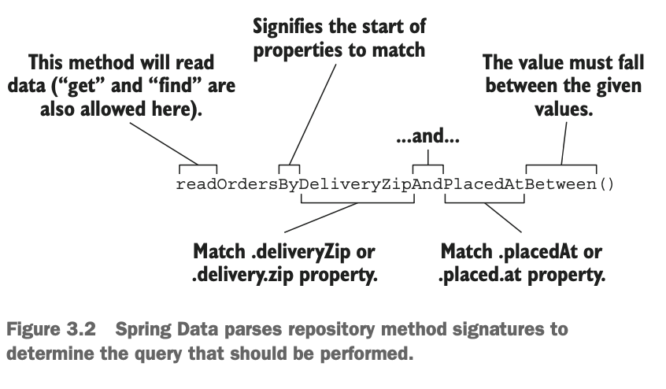
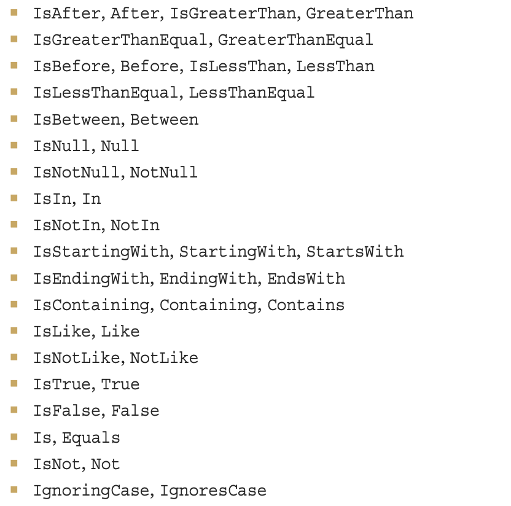

# Persisting data with Spring Data JPA
[**Java Persistence API (JPA)**](https://en.wikipedia.org/wiki/Jakarta_Persistence) is another popular option for working with data in a relational database. This is specification of API Java EE, ORM conception. We will work with it using **Spring Data JPA**.
## Adding Spring Data JPA to the project
Spring Data JPA is available to Spring Boot as JPA starter. It also transitively includes [Hibernate](https://en.wikipedia.org/wiki/Hibernate_(framework)) as JPA Implementation. If you want to use another implementation, you need to exclude Hibernate and include what you want.
Add the dependency ([code](https://github.com/bozhnyukAlex/spring-in-action-project/commit/9a78aa6676488be9f6991bb24babbe4e9c0b80ad#diff-9c5fb3d1b7e3b0f54bc5c4182965c4fe1f9023d449017cece3005d3f90e8e4d8)):
```xml
<dependency> 
	<groupId>org.springframework.boot</groupId> 
	<artifactId>spring-boot-starter-data-jpa</artifactId>
</dependency>
```
## Annotating the domain as entities
We need to annotate classes with some annotations. (see [code](https://github.com/bozhnyukAlex/spring-in-action-project/commit/5ace45ca655eb804daeb7fd479a51dd59a853f4e))
- `@Entity` - this class is a JPA Entity: [POJO](https://www.baeldung.com/java-pojo-class) class, mapped to the database table. It must have empty constructor, it is not inner, `interface` or `enum`, is not `final`, must contain at least one `@Id` field. It can contain non-empty constructors, extend or be extended, contain other methods or implement interfaces.
- `@Id` - property uniquely identifies the entity in database. Note: other package: `javax.persistence` 
- `@NoArgsConstructor(access= AccessLevel.PRIVATE, force=true) `- Lombok annotation, generates constructor with no arguments. JPA Entities must have such. We don't want to use it for Ingredient, so we make it `private`. force: set `final` properties to default values. 
- `@AllArgsContstructor` - from Lombok: generate constructor with all arguments.
- `@RequiredArgsConstructor` - from Lombok: generate constructor with required argsuments. `@Data` adds it, but when `@NoArgsConstructor` is used, that constructor is removed. This annotation ensures that we still have required argument constructor.
- `@GeneratedValue` - we rely on that property value is generated by database automatically, `strategy` is `AUTO` (for `Taco`).
- `@ManyToMany` - relationship many-to-many between two entities (for us: `Taco` and `Ingredient`)
- `@OneToMany` - relationship one-to-many (tacos are specific for one order). `CascadeType.ALL`  - if order is deleted, its relted tacos will also be deleted.
## Declaring JPA repositories
- `CrudRepository` works equally well for Spring Data JPA. 
- It is used across many of Spring Data's projects, regardless of the underlying persistence mechanism.
## Customizing repositories
- Imagine that you need to add some new method, that is not provided by `CrubRepository` 
- **Example**:  fetch all the orders delivered to a given ZIP code
We can just add such method to the `OrderRepository`:
```java
List<TacoOrder> findByDeliveryZip(String deliveryZip);
```
- Spring Data generates repository implementations. It examines each method in the repository interface, parses the method name, and tries to understand method's putpose in the context of persisted object (`TacoOrder` in our example).
- So, method above is declared in `CrubRepository` parameterized with `TacoOrder`. Using this information and method name, `Spring Data` understands, that this method should find all `TacoOrder` entities by matching their `deliveryZip` property with the value passed in as a parameter to the method.
- Methods in repository are composed of a **verb**, **optional subject**, **word By**, and **predicate**.
- **Next example**:  Suppose that you need to query for all orders delivered to a given ZIP code within a given date range.
```java
List<TacoOrder> readOrdersByDeliveryZipAndPlacedAtBetween(String deliveryZip, Date startDate, Date endDate);
```
- Scheme of the method name:
  
- Now verb is **read**. Spring Data understands **find**, **read** and **get** as synonymous for fetching one or more entities. Also you can use a **count** verb if you want to get `int` value.
- **Subject name** is optional, but here we use a Orders. Spring Data ignores it, so we can write whatever we want.
- **Predicate** follows the word **By**. In our example it refers to two TacoOrder properties: `delivaryZip` and `placedAt`.  `deliveryZip` property must be equal to the first parameter of the method. Keyword `Between` indicates that `placedAt` property must fall between the values passed into the last two parameters of the method.
- There are more keywords:
  
- But what if query is more complex? We can use `@Query` annotation!
- **Example**
```java
@Query("Order o where o.deliveryCity='Seattle'")
List<TacoOrder> readOrdersDeliveredInSeattle();
```
- We write any **JPA query** we like in braces, but we don't need to name method by convention mentioned before.
- Custom query methods also work with **Spring Data JDBC**. But there are differences.
-  **All custom query methods require `@Query`**. This is because, unlike JPA, there’s no mapping metadata to help Spring Data JDBC automatically infer the query from the method name.
-  All queries specified in `@Query` must be **SQL queries, not JPA queries**.
- See ([code](https://github.com/bozhnyukAlex/spring-in-action-project/commit/f03ab2e5d24bb6f3250ad6d38e6351eecde13697))