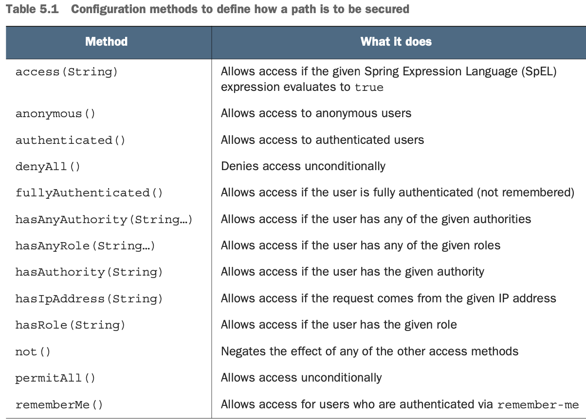
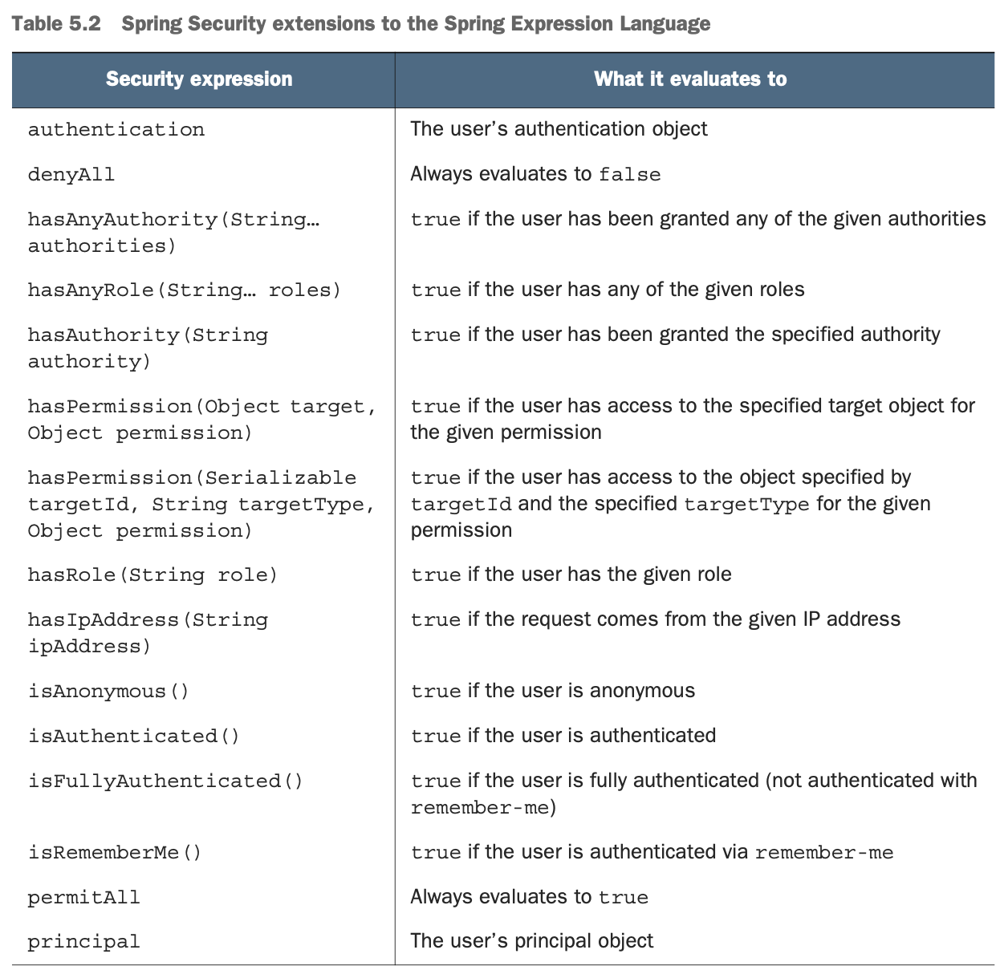

# Securing web requests
 - The security requirements for our app should require that a user be authenticated before designing tacos or placing orders. 
 - But the home page, login page, and registration page should be available to unauthenticated users.
 - We need to define `SecurityFilterChain` bean. Here is a minimal example:
 ```java
@Bean  
public SecurityFilterChain filterChain(HttpSecurity http) throws Exception {
	return http.build();
} 
 ```
 - `HttpSecurity` object act as a builder that can be used to configure how security is handled at the web level.
 - `build()` will create `SecurityFilterChain`, that will be returned from the bean method.
**The following are among the many things you can configure with `HttpSecurity`:**
- Requiring that certain security conditions be met before allowing a request to be served  
- Configuring a custom login page  
- Enabling users to log out of the application  
- Configuring cross-site request forgery protection
We need to ensure that customers meet needed requirements.
## Securing requests
We need to ensure that requests for `/design` and `/orders` are available only to authenticated users. All other requests should be permitted to all users.
Let's write this `SecutityFilterChain` :
```java
@Bean  
public SecurityFilterChain filterChain(HttpSecurity http) throws Exception {
 return http
    .authorizeRequests() 
		.antMatchers("/design", "/orders").hasRole("USER") 
		.antMatchers("/", "/**").permitAll()

	.and()
	.build(); 
}
```
- `authorizeRequests()` returns an object  (`ExpressionUrlAuthorization- Configurer.ExpressionInterceptUrlRegistry`), on which we can specify URL paths, patterns and security requirements for those paths.
-  Requests for `/design` and `/orders` should be for users with a granted authority of `ROLE_USER`. Don’t include the `ROLE_` prefix on roles passed to `hasRole()`; it will be assumed by `hasRole()`.
- All requests should be permitted to all users.
- Order of this rules is important! If we swap our two rules, the first will match and all requests would have `permitAll()` applied to them. Second rulw would have no effect!
- There are more methods than just then just `hasRole()` and `permitAll()`:

- `access(String)` method gets a **Spring Expression Language (SpEL)** expression to declare richer security rules. 
- **Spring Security extends SpEL** to include several security-specific values and functions, as listed here.

- Most of expression extensions here coorespond to the methods in table before.
- We can rewrite SecurityFilterChain as follows:
```java
@Bean  
public SecurityFilterChain filterChain(HttpSecurity http) throws Exception {
	return http
	    .authorizeRequests() 
			.antMatchers("/design", "/orders").access("hasRole('USER')") 
			.antMatchers("/", "/**").access("permitAll()")

		.and()
		.build(); 
}
```
- We can do more flexible thing.
-  For instance, suppose that (for some crazy reason) you wanted to allow only users with `ROLE_USER` authority to create new tacos on Tuesdays (for example, on Taco Tuesday). Let's rewrite method!
```java
@Bean  
public SecurityFilterChain filterChain(HttpSecurity http) throws Exception {
	return http
	    .authorizeRequests() 
			.antMatchers("/design", "/orders")
		        .access("hasRole('USER') && " + 
						"T(java.util.Calendar).getInstance().get("+ 
						"T(java.util.Calendar).DAY_OF_WEEK) == " + 
						"T(java.util.Calendar).TUESDAY")
			 .antMatchers("/", "/**").access("permitAll") 	
		.and()
		.build(); 
}
```
Using `SecurityFilterChain` and **SpEL expressions**, we can declare different rules for users.
Now, let's customize login page!
## Creating a custom login page
Firstly, we need to tell Spring Security what path our csutom logic page will be at.
We can do it in `filterChain()` :
```java
@Bean  
public SecurityFilterChain filterChain(HttpSecurity http) throws Exception {

	return http
	    .authorizeRequests() 
			.antMatchers("/design", "/orders").access("hasRole('USER')") 
			.antMatchers("/", "/**").access("permitAll()")

		.and()
	      .formLogin() 
			.loginPage("/login") 

		.and()
		.build(); 
}
```
- To replace built-in login page, we call `formLogin()` on the HttpSecurity object.
- `and()` method:  signifies that we’re finished with the authorization configuration and are ready to apply some additional HTTP configuration. This is bridge between sections of configuring.
- `loginPage()`:  designates the path where your custom login page will be provided. When Spring Security determines that the user is unauthenticated and needs to log in, it will redirect them to this path.
Now controller. It does not do anything, so we define it in `WebConfig` :
```java
@Override  
public void addViewControllers(ViewControllerRegistry registry) {
	 registry.addViewController("/").setViewName("home");
	 registry.addViewController("/login");
}
```
Now create login page itself: [code]
- Spring Security listens for login requests at /login and expects that the username and password fields will be named **"username"** and **"password"**. It is configurable:
```java
.and()
	.formLogin() 

	.loginPage("/login")
	.loginProcessingUrl("/authenticate")
    .usernameParameter("user")
    .passwordParameter("pwd")
```
Here, we say that Spring Security should listen  `/authenticate` to handle login submissions. Also, the username and password fields should now be named user and pwd.
- By default successfull login will redirect to the page that they were navigating to when Spring Security determined that they needed to log in. 
- If user navigated to the /login page, it redirects to the root. We can change that by specifying a default success page:
```java
.and()
  .formLogin() 

  .loginPage("/login")
  .defaultSuccessUrl("/design")
```
Here, if the user were to successfully log in after directly going to the login page, they would be directed to the `/design` page.
We can force the user to the design page after login, even if they were navigating elsewhere prior to logging in, by passing true as second paraneter to `defaultSuccessUrl`:
```java
.and()
  .formLogin() 
	 .loginPage("/login")
     .defaultSuccessUrl("/design", true)
```
##  Enabling third-party authentication
- We can implement  “Sign in with Facebook,” “Log in with Twitter,” or something similar.
- This type of authentication is based on a **OAuth2** or **OpenID Connect (OIDC)**.
- **OpenID Connect** is another security specification that is based on OAuth2  to formalize the interaction that takes place during a third-party authentication.
- Add the OAuth2 client starter
```xml
<dependency>  
	<groupId>org.springframework.boot</groupId> 
	<artifactId>spring-boot-starter-oauth2-client</artifactId>
</dependency>
``` 
-  We’ll need to configure details about one or more OAuth2 or OpenID Connect servers that we want to be able to authenticate against. Spring Security supports sign-in with Facebook, Google, GitHub, and Okta out of the box. We can configure other clients too!
- There is a general set of properties: 
```
spring:
    security: 
	    oauth2:
            client: 
	            registration:
	                <oauth2 or openid provider name>: 
						clientId: <client id>
		                clientSecret: <client secret>
	                    scope: <comma-separated list of requested scopes>
```
For example, Facebook.
In `application.yml`  the following configuration will set up the OAuth2 client:
```
spring:
	security: 
		oauth2:
            client: 
				registration:
	                facebook: 
						 clientId: <facebook client id>
			             clientSecret: <facebook client secret>
			             scope: email, public_profile
```
- `clientId` and `clientSecret` we can obtain from by creating a new application entry at https://developers.facebook.com/
- When the user attempts to access a page that requires authentication, their browser will redirect to Facebook. 
- If they’re not already logged in to Facebook, they’ll be greeted with the Facebook sign-in page. 
- After signing in to Facebook, they’ll be asked to authorize your application and grant the requested scope.
- Finally, they’ll be redirected back to your application, where they will have been authenticated.
Also we need to enable this authorization in `SecurityFilterChain` :
```java
...
.and()
      .oauth2Login()
...
```
- We may want to enable third-party login on the same `/login` page:
```java
...
.and()
      .oauth2Login()
	      .loginPage("/login")
...
```
- Also we need to provide a log in with Facebook on log in page:
```html
<a th:href="/oauth2/authorization/facebook">Sign in with Facebook</a>
```
- Now let's enable the log out. 
```java
.and()
    .logout()
```
This sets up a security filter that intercepts POST requests to /logout.
- Also let's make a logout form and button
```html
<form method="POST" th:action="@{/logout}">
    <input type="submit" value="Logout"/> 
</form>
```
- When the user clicks the button, their session will be cleared, and they will be logged out of the application.
- By default, they’ll be redirected to the login page where they can log in again. We can specify this behaviour:
```java
.and()
    .logout() 
		.logoutSuccessUrl("/")
``` 
Now we redirect to the home page.
##  Preventing cross-site request forgery
 **Cross-site request forgery (CSRF)** - common security attack.
 - **In a CSRF attack**, an innocent end user is tricked by an attacker into submitting a web request that they did not intend. This may cause actions to be performed on the website that can include inadvertent client or server data leakage, change of session state, or manipulation of an end user's account.
 - **Example**: A user may be presented with a form on an attacker’s website that automatically posts to a URL on the user’s banking website (which is presumably poorly designed and vulnerable to such an attack) to transfer money. The user may not even know that the attack happened until they notice money missing from their account.
 How to protect against such attacks?
 - **Application can generate CSRF token** upon displaying a form, set this token to the hidden field, and then keep it for the later use on server. 
 - **When the form is submitted**, token is sent back to the server with the rest form data. 
 - **Then request is intercepted by server and compared with the token that was originally generated**. If matches, request is allowed to proceed. Otherwise, the form must have been rendered by an evil website without knowledge of the token generated by the server.
 **Spring Security has built-in CSRF protection.** Also, it is enabled by default!
 You only need to make sure that any forms yout application submits include a field named `_csrf` that contains the csrf token.
 You can use a hidden field with this template:
 ```html
<input type="hidden" name="_csrf" th:value="${_csrf.token}"/>
 ```
 If you are using Thymeleaf with Spring Security, you don't even need to do that.  
In Thymeleaf, you just need to make sure that one of the attributes of the `<form>` element is prefixed as a Thymeleaf attribute.
We can disable this protection:
```java
...
.and()
  .csrf() 
	.disable()
...
```

