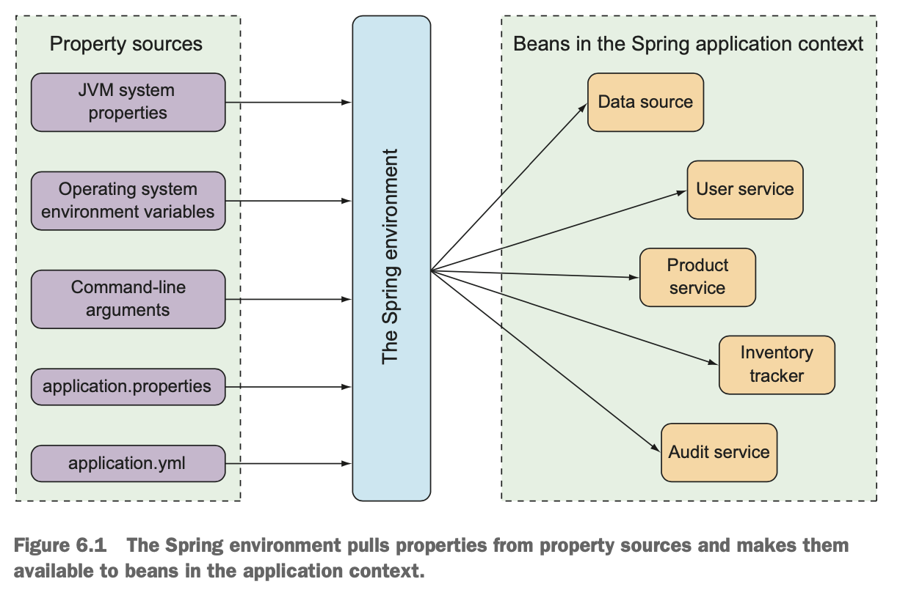

 **Spring Boot** with its autoconfiguration simplifies Spring application development.  
- Spring Boot provides a way to set property values on application components with configuration properties.
- **Configuration properties** -  `@ConfigurationProperties`-annotated beans in the Spring application context. 
- **Spring will inject values from one of several property sources**— including JVM system properties, command-line arguments, and environment vari- ables—**into the bean properties**.
#  Fine-tuning autoconfiguration
There are some kinds of **configurations in Spring**:
- **Bean wiring**—Configuration that declares application components to be created as beans in the Spring application context and how they should be injected into each other.
- **Property injection**—Configuration that sets values on beans in the Spring application context.
In Spring XML, we declare these two types in same place.  In Java conifuration,  
`@Bean`-annotated method is likely to both instantiate a bean and then set values to its properties.
**Example**: `@Bean` method declares a DataSource for an embeddee H2 database:
```java
@Bean
public DataSource dataSource() { 
	 return new EmbeddedDatabaseBuilder()
        .setType(H2) 
		.addScript("taco_schema.sql") 
		.addScripts("user_data.sql", "ingredient_data.sql") 
		.build();
}
```
- `addScript()` and `addScripts()` methods set some `String` properties with the name of SQL scripts that should be applied to the database once the data source is ready.
- If we are using Spring Boot, this method is competely unnecessary.  
If the H2 dependency is available in the runtime classpath, Spring Boot automatically creates in the Spring application context an appropriate `DataSource` bean, which applies the SQL scripts `schema.sql` and `data.sql`.
- What if we want to specify SQL scripts? Or we need more then two scripts? Here we need to use configuration properties.
##  Understanding Spring’s environment abstraction

- **Spring environment abstraction** abstracts the origins of properties so that beans needing those properties can con- sume them from Spring itself
It pulls from several property sources, includeing the following:
-  JVM system properties  
- Operating system environment variables 
- Command-line arguments  
- Application property configuration files
Then, it aggregates those properties into a single source from which Spring beans can be injected.
-  The beans that are automatically configured by Spring Boot are all configurable by properties drawn from the Spring environment.
**Example:** if we want to underlying servlet container to listen for requests on some port other the default 8080, we can specify a port by setting it in `application.properties` :
```
server.port=9090
```
Or, we can use YAML. We can set value in `src/main/resources/application.yml`:
```yaml
server:
	port: 9090
```
We also could do it externally, via a command line:
```bash
$ java -jar tacocloud-0.0.5-SNAPSHOT.jar --server.port=9090
```
We could also set a operating system runtime environment, so application will always start with new port:
```bash
$ export SERVER_PORT=9090
```
There is no propblems with naming. Spring will interpret this `SERVER_PORT` as `server.port` 
## Configuring a data source
What if we would like to change database or something else?
We could configure our own `DataSource` bean, but it is unnecessary. It's simpler to use configuration properties. We can configure URL and credentials for database. 
**Example**: if we were to start using a **MySQL** database:
```yaml
spring:
	datasource:
		url: jdbc:mysql://localhost/tacocloud
		username: tacouser
		password: tacopassword
```
Also you'll need to add appropriate JDBC driver to the build. Usually Spring Boot can figure it out, but if there is a problem, you can set the property:
```yaml
spring:
  datasource: 
	url: jdbc:mysql://localhost/tacocloud
    username: tacouser
    password: tacopassword
    driver-class-name: com.mysql.jdbc.Driver
```
**Spring boot** uses this information to autoconfigure the `DataSource` bean.
It will be pooled using **HikariCP** connection pool if it's available on the classpath. 
If not, Spring Boot looks for and uses one of the following connection pool implementations on the classpath:
- Tomcat JDBC Connection Pool 
- Apache Commons DBCP2
We can specify connection pool via configuring `DataSource` bean.
Now, let's specify initialization scripts!
```yaml
spring:
  datasource: 
	schema:
	- order-schema.sql
	- ingredient-schema.sql
	- taco-schema.sql
	- user-schema.sql
    data:
    - ingredients.sql
```
Also, we could use Java Naming and Directory Interface ([JNDI](https://docs.oracle.com/javase/jndi/tutorial/getStarted/overview/index.html)) and have Spring look for data source information here:
```yaml
spring:
  datasource: 
	  jndi-name: java:/comp/env/jdbc/tacoCloudDS
```
If we set the `spring.datasource.jndi-name` property, the other data source connection properties (if set) are ignored.
## Configuring the embedded server
We have already seen how to configure servet's container port. What if set it to 0?
```yaml
server:
    port: 0
```
**Server won't start at port 0. It will start on andomly chosen port.** It is useful when running automated integration tests  to ensure that any concurrently running tests don’t clash on a hardcoded port number. 
But there is more to configure. Once of the common things: you need to set underlying container up ti handle HTTPS requests. To do that:
1. Create a keystore using JDK's `keytool` command-line utility:
```bash
$ keytool -keystore mykeys.jks -genkey -alias tomcat -keyalg RSA
```
 We’ll be asked several questions about your name and organization, most of which are irrelevant. But when asked for a password, we need to remember what we choose.
 2. Set a few properties to enable HTTPS in the embedded server. We could do it via command line, but that's inconvenient. We will do it in `application.yml`:
 ```yaml
server:
    port: 8443
    ssl: 
		key-store: file:///path/to/mykeys.jks
        key-store-password: letmein
        key-password: letmein
 ```
- `server.port` is set to `8443` - common choice for development HTTPS servers. 
- `server.ssl.key-store` property should be set to the path where the keystore file is created. There is a `file://` URL to load it from the filesystem. If we package it within application JAR file, we can use a `classpath:` URL to reference it. 
-  Both `server.ssl.key-store-password` and `server.ssl.key-password` properties are set to the password that was given when creating the keystore.
Now, our application listens for HTTPS requests on port 8443.
## Configuring logging
By default, Spring Boot configures logging via [Logback](https://logback.qos.ch/) to write to the console at an INFO level. We could see it when we run the application:
```
2021-07-29 17:24:24.187 INFO 52240 --- [nio-8080-exec-1]  
➥ com.example.demo.Hello Here's a log entry. 
2021-07-29 17:24:24.187 INFO 52240 --- [nio-8080-exec-1]  
➥ com.example.demo.Hello Here's another log entry. 2021-07-29 17:24:24.187 INFO 52240 --- [nio-8080-exec-1]  
➥ com.example.demo.Hello And here's one more.
```
We can fully control over the logging configuration **by creating `logback.xml` file at the root of the classpath.**
Example: 
```xml
<configuration>  
	<appender name="STDOUT" class="ch.qos.logback.core.ConsoleAppender">
		<encoder>
	        <pattern> 
				 %d{HH:mm:ss.SSS} [%thread] %-5level %logger{36} - %msg%n 
			</pattern>
		</encoder>
	</appender>
	<logger name="root" level="INFO"/>
	<root level="INFO"> 
	    <appender-ref ref="STDOUT" />
	</root> 
</configuration>
```
That's the new look of log entries:
```
17:25:09.088 [http-nio-8080-exec-1] INFO com.example.demo.Hello -
									Here's a log entry.
17:25:09.088 [http-nio-8080-exec-1] INFO com.example.demo.Hello -
									Here's another log entry.
17:25:09.088 [http-nio-8080-exec-1] INFO com.example.demo.Hello -
									And here's one more.
```
**With Spring Boot configuration properties, we can make those changes without creating a `logback.xml` file.**
- Set logging levels: we create properties that are prefixed with `logging.level`,  
followed by the name of the logger for which you want to set the logging level.
**Example**: we want to set the root logging level to WARN, but log Spring Security logs at a DEBUG level:
```yaml
logging:
  level: 
	 root: WARN
	 org: 
		 springframework:
	        security: DEBUG
```
We can collapse package name to a single line for easier reading:
```yaml
logging:
  level: 
	 root: WARN
     org.springframework.security: DEBUG
```
What if we want to write the log entries to the file `TacoCloud.log` at `/var/logs`? We can do this:
```yaml
logging:
  file: 
	 path: /var/logs/ 
	 file: TacoCloud.log
  level: 
	 root: WARN
	 org: 
		 springframework:
	        security: DEBUG
```
 Assuming that the application has write permissions to` /var/logs/`, the log entries will be written to `/var/logs/TacoCloud.log`.  By default, the log files rotate once they reach 10 MB in size.
## Using special property values
We can **derive property values** from other configuration properties.
Example: we want to set a property named `greeting.welcome` to echo the value of another property named `spring.application.name`. We can use a `${}` placeholder markers: 
```yaml
greeting:
  welcome: ${spring.application.name}
```
We can even embed that placeholder amid other text. as shown here:
```yaml
greeting:
  welcome: You are using ${spring.application.name}.
```
