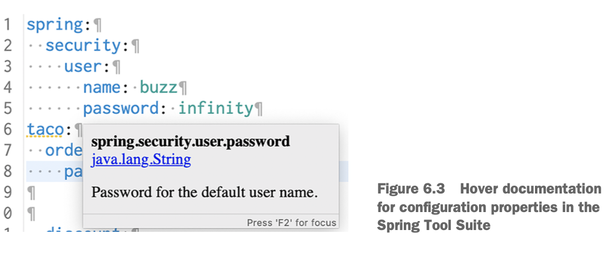
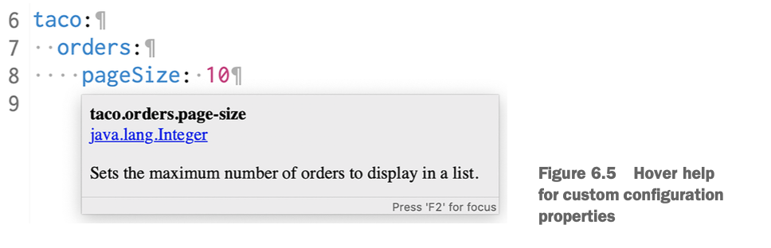
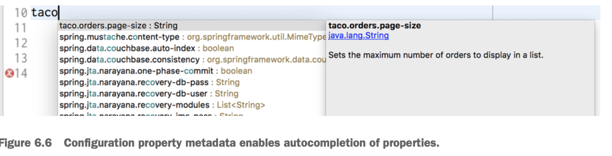

# Creating your own configuration properties
- **Configuration properties are nothing more than properties of beans that have been designated to accept configurations from Spring's environment abstraction.**
- How those beans are designated to consume those configurations? 
- **Spring Boot** provides `@ConfigurationProperties` annotation. When it is placed on Spring bean, it says: **properties of that bean can be injected from Spring environment.**
- Example: suppose we have added the following method to `OrderController`. It llists the authentocated user's past orders:
```java
@GetMapping
public String ordersForUser( 
	 @AuthenticationPrincipal User user, Model model) { 
	 model.addAttribute("orders", orderRepo.findByUserOrderByPlacedAtDesc(user));
	 return "orderList";
}
```
Also, we've added this method to `OrderRepository`:
```java
List<Order> findByUserOrderByPlacedAtDesc(User user);
```
This method is useful, when there are not too many orders. But if there are many of them? A big list of orders in browser is just a noise for user.  **We need to limit the number of displayed orders to the most recent 20 orders.**
We can change `ordersForUser()` as follows:
```java
@GetMapping
public String ordersForUser(
	 @AuthenticationPrincipal User user, Model model) { 
	 Pageable pageable = PageRequest.of(0, 20);
	 model.addAttribute("orders", 
		orderRepo.findByUserOrderByPlacedAtDesc(user, pageable));
		
	 return "orderList";
}
```
And change to repository:
```java
List<TacoOrder> findByUserOrderByPlacedAtDesc(User user, Pageable pageable);
```
- `Pageable`  - **Spring Data's** way of selecting some subset of the results by a page number and page size. In example, we requests the first page (0) with a page size of 20 to get up to 20 of the most recently placed orders for the user. 
- **Problem:** 20 is hardcoded, it won't be very convenient to change later. 
- We can set a custom configuration property:
1. Add a new property called `pageSize`  to `OrderController`.
2. Annotate `OrderController` with `@ConfigurationProperties` as shown below:
```java
@Controller
@RequestMapping("/orders")
@SessionAttributes("order")
@ConfigurationProperties(prefix="taco.orders")
public class OrderController { 

	private int pageSize = 20; 

	public void setPageSize(int pageSize) {
        this.pageSize = pageSize; 
	}

 ...
    @GetMapping
    public String ordersForUser( 
		@AuthenticationPrincipal User user, Model model) { 

		Pageable pageable = PageRequest.of(0, pageSize);
	    model.addAttribute("orders", 
			orderRepo.findByUserOrderByPlacedAtDesc(user, pageable)); 
		return "orderList";
	} 
}
``` 
- We added `@ConfigurationProperties` annotation with prefix attribute `taco.orders`. It means, that when setting pageSize property, we need to use a configuration property `taco.orders.pageSize`.
- Default value is 20, but we can change it easily, for example, in `application.yml`:
```yaml
taco:
    orders: 
		pageSize: 10
```
- For quick change in production, we can use command line:
```bash
$ export TACO_ORDERS_PAGESIZE=10
```
## Defining configuration property holders
- As usual, `@ConfigurationProperties` are placed on beans that are holders of configuration data. **This keeps configuration-specific details out of application classes and makes easy to share common configuration properties.** 
- We can extract pageSize property to a separate class:
```java
@Component
@ConfigurationProperties(prefix="taco.orders")
@Data
public class OrderProps { 
	 private int pageSize = 20;
}
```
- `@Component `annotation: Spring component scanning will discover this class and create a bean in Spring application context.
- **Configuration property holders** - beans that have their properties injected from the Spring environment.
- We can **inject them** into any other bean that needs those properties.
Example in `OrderController`:
```java
private OrderProps props; 

public OrderController(OrderRepository orderRepo,
               OrderProps props) { 

  this.orderRepo = orderRepo; 
  this.props = props;
}

...

@GetMapping
public String ordersForUser( 
	 @AuthenticationPrincipal User user, Model model) { 

		Pageable pageable = PageRequest.of(0, props.getPageSize()); 
		model.addAttribute("orders",
			orderRepo.findByUserOrderByPlacedAtDesc(user, pageable));

		return "orderList";
}
```
- Now we can reuse a propweties on other beans, not only that controller!
- To change properties, we need to make changes only in `OrderProps`. Also, for testing, we can set configuration properties directly on a test-specific OrderProps and give it to the controller prior to the test.
- We can validate value of property:
```java
@Component
@ConfigurationProperties(prefix="taco.orders")
@Data
@Validated
public class OrderProps { 

  @Min(value=5, message="must be between 5 and 25")
  @Max(value=25, message="must be between 5 and 25")
  private int pageSize = 20; 

}
```
Here we limit property value between 5 and 25. Without this holder - we need to add this validation in all entries of this property, and that's inconvinient.
## Declaring configuration property metadata
We can create a configuration properties metadata to provide some minimal documentation around the configuration properties. 
**Example:**  
To create metadata: 
1. Add a file under META-INF (in `src/main/resources/META-INF`), named  `additional-spring-configuration-metadata.json` . We can generate if via IDEA quick-fix.
2. Fill the file with property information (here is info generated by IDEA): 
```json
{"properties": [{  
	"name": "taco.orders.page-size",  
	"type": "java.lang.String",  
	"description": "A description for 'taco.orders.page-size'"
}]}
```
**Notice**: property name is page-size, not pageSize. Spring boot has flexible naming, so this is not a problem.
We need to edit it. Type of our property is Ingeger, not String. And also we need to change a description. 
```json
{"properties": [{
          "name": "taco.orders.page-size",
          "type": "java.lang.Integer",
	      "description": "Sets the maximum number of orders to display in a list."
}]}
```
Now we have a documentation shown in IDE:


